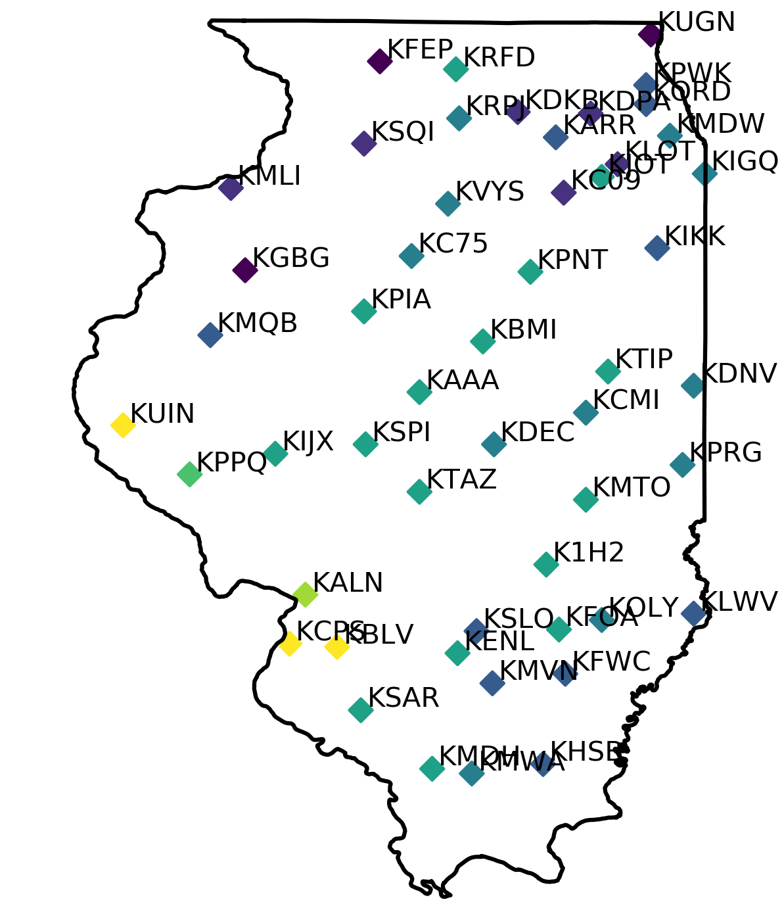

# Python Capstone

## Overview

This capstone project is built around using Python to collect data from a remote source, process the data by passing it between transformative scripts, and finally plot the data.

We will use current temperature data for the State of Illinois.



## Target Usage

```sh
$ python grab-stations.py > stations.txt
$ python grab-forecast.py < stations.txt > forecast.txt
$ python plot-forecast.py < forecast.txt
```

Urbana is 40.1097° N, 88.2042° W

```sh
$ python interp-forecast.py --lat=40.1 --lon=88.2 < forecast.txt
```

## Development

We highly recommend using the test-driven development process for this.  You should first write tests for each step of your process (processing input, carrying out the calculation, and producing output) so that you know the program step works as expected.  

Done properly, this should mean that we can randomize the scripts between groups and still have everything work as expected.

You need to write the following scripts:

- `grab-stations.py`
- `grab-forecast.py`

The following scripts are provided already in full:

- `plot-forecast.py`
- `interp-forecast.py`

You may need to learn how to process certain kinds of data.  For instance, how do you retrieve `stdin` standard input data from inside of a script?  You can look in `plot-forecast.py` to get an idea of how that should work.  You can retrieve data from a remote source using `requests` (several other libraries support this as well, but we think `requests` is the easiest one to use).

### `grab-stations.py`

`grab-stations.py` expects no input.

`grab-stations.py` produces a list of weather stations in the format 

```
K1H2	-88.53	+39.07
KAAA	-89.33	+40.16
KALN	-90.05	+38.88
...
```

at `stdout` standard output.  The weather stations are those of the state of Illinois, which may be found online at [the National Weather Service](http://www.nws.noaa.gov/mdl/gfslamp/docs/stations_info.shtml).  These should not be copied, but should be dynamically loaded from that site whenever the script is run.

### `grab-forecast.py`

`grab-forecast.py` expects input in the format

```
K1H2	-88.53	+39.07
KAAA	-89.33	+40.16
KALN	-90.05	+38.88
...
```

at `stdin` standard input.

`grab-forecast.py` produces a list of weather stations in the format 

```
K1H2	-88.53	+39.07	76
KAAA	-89.33	+40.16	69
KALN	-90.05	+38.88	72
...
```

with the current temperature added as a fourth column at `stdout` standard output.  The weather data should be retrieved from [the National Weather Service](https://www.nws.noaa.gov/mdl/gfslamp/bull/lavlamp.txt) in real time for the current temperature (row `TMP`), typically the first column (hour in `UTC`).

## Progress & Completion

You should fork this project and work exclusively in the `python/` folder.  We expect you to compose four scripts:

- `grab-stations.py` as described above.
- `grab-forecast.py` as described above.
- `test-grab-stations.py` with appropriate unit tests to make sure functions work as they should.
- `test-grab-forecast.py` with appropriate unit tests to make sure functions work as they should.
